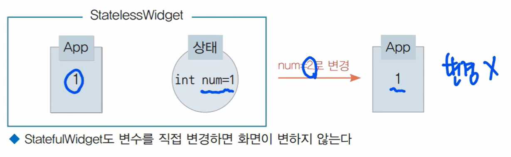
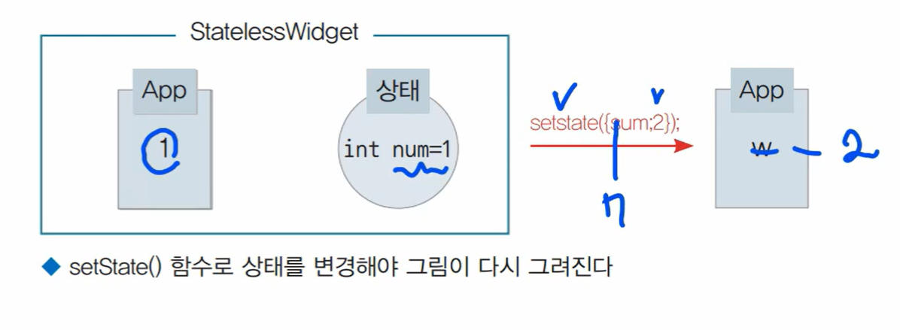

### 1. StatefulWidget 이란 ? 
- 변경 가능한 위젯이다.
- 위젯이 처음 화면에 그려질 때 변수의 값에 따라 위젯을 그릴 수 있고, 
- 화면에 그림이 그려진 후 사용자에 액션에 따라 위젯을 다시 그릴 수도 있는 위젯이다.

### 2. StatefulWidget과 StatelessWidget의 차이
- UI를 만들면 UI가 항상 고정되어 있지 않다.
- 사용자와 상호작용하는 UI에는 상태가 있다.
- 상태가 없으면 그림이 다시 그려지지 않는다.(stateless)

1) Stateful Widget

- 변수를 직접 변경해서는 화면이 다시 그려지지 않는다. 
- 플러터에서 다시 그린다는 의미는 build() 함수가 다시 실행되는 것이다.
- setState 함수로 상태변수를 변경하면 build 함수가 다시 실행된다.

- 즉 그림을 그리려면
  - Stateful
  - 상태 => 변수
  - 변수 -> setState() -> build 재호출

